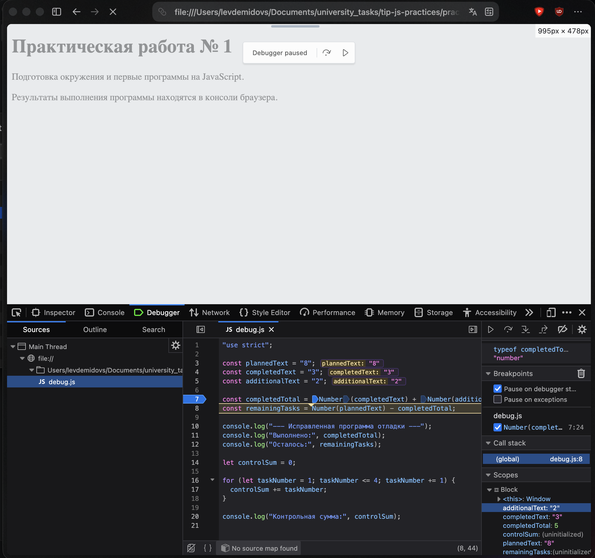

# Практическая работа № 1: JavaScript

## 1. Автор и вариант

| Параметр | Значение |
| --- | --- |
| Автор | Демидовс Лев |
| Группа | ЭФБО-05-25 |
| Вариант | 7 |
| Данные варианта | `totalTasks = 10`, `completedTasks = 7`, `dailyLimit = 3` |

## 2. Окружение

| Компонент | Версия / значение |
| --- | --- |
| Операционная система | macOS 27.0 |
| Node.js | v24.21.0 |
| npm | 11.19.0 |
| Git | 2.50.1 (Apple Git-155) |
| Браузер | Запуск в браузере ещё не выполнен |

## 3. Запуск

Команды выполняются из корня репозитория. На этом Mac Node.js 24 установлен через Homebrew. Для его выбора в текущем терминале:

```sh
export PATH="/opt/homebrew/opt/node@24/bin:$PATH"
```

Запуск файлов:

```sh
node practice-01/js/hello.js
node practice-01/js/types.js
node practice-01/js/progress.js
node practice-01/js/plan.js
node practice-01/js/debug.js
```

Для запуска в браузере нужно открыть `practice-01/index.html`, в теге `script` указать нужный файл, перезагрузить страницу и открыть вкладку Console. После проверки в `index.html` должен остаться файл `./js/hello.js`.

## 4. Задание 1. Node.js и браузер

При запуске `node practice-01/js/hello.js` в терминале получено:

```text
Студент Демидовс Лев
Группа ЭФБО-05-25
Практическая работа: 1
JavaScript успешно запущен
Тип document: undefined
```

В Node.js нет объекта страницы `document`. В браузере ожидается `Тип document: object`, потому что там этот объект есть. Вывод браузера нужно проверить в Console.

## 5. Задание 2. Типы и преобразования

Результаты проверены в Node.js 24.

| Выражение | Прогноз до запуска | Фактическое значение | Тип результата | Объяснение |
| --- | --- | --- | --- | --- |
| `"8" + 2` | `"82"`, строка | `"82"` | `string` | При сложении со строкой число становится текстом. |
| `"8" - 2` | `6`, число | `6` | `number` | Вычитание преобразует строку в число. |
| `Number("8") + 2` | `10`, число | `10` | `number` | После преобразования складываются два числа. |
| `"12" > "3"` | `false`, логическое | `false` | `boolean` | Строки сравниваются посимвольно: `"1"` меньше `"3"`. |
| `12 === "12"` | `false`, логическое | `false` | `boolean` | Строгое сравнение учитывает разные типы. |
| `Number("")` | `0`, число | `0` | `number` | Пустая строка преобразуется в ноль. |
| `Number("text")` | `NaN`, число | `NaN` | `number` | Из текста нельзя получить число; `NaN` относится к типу `number`. |
| `Boolean("false")` | `true`, логическое | `true` | `boolean` | Любая непустая строка преобразуется в `true`. |
| `typeof null` | `"object"`, строка | `"object"` | `string` | Историческая особенность `typeof`; само `null` — примитивное значение. |
| `typeof NaN` | `"number"`, строка | `"number"` | `string` | `NaN` имеет числовой тип, а `typeof` возвращает строку. |

## 6. Задание 3. Сводка выполнения задач

Проверки выполнены в Node.js 24. В ошибочных случаях программа выводила одно сообщение: `Ошибка: количество задач должно быть целым числом от 0 до 1000, а выполненных задач не может быть больше общего количества.` Сводка после ошибки не выводилась.

| Вход: totalTasks, completedTasks | Ожидание | Фактический результат | Итог |
| --- | --- | --- | --- |
| `12, 5` | Остаток 7; 41.7%; «В работе» | Остаток 7; 41.7%; «В работе» | Пройдено |
| `0, 0` | Нет задач; процент не считается | «Задач пока нет.» | Пройдено |
| `5, 0` | Остаток 5; 0.0%; «Не начато» | Остаток 5; 0.0%; «Не начато» | Пройдено |
| `5, 5` | Остаток 0; 100.0%; «Завершено» | Остаток 0; 100.0%; «Завершено» | Пройдено |
| `5, 6` | Ошибка: выполнено больше общего числа | Одно сообщение «Ошибка: …» | Пройдено |
| `-1, 0` | Ошибка: отрицательное число | Одно сообщение «Ошибка: …» | Пройдено |
| `5, 2.5` | Ошибка: дробное число | Одно сообщение «Ошибка: …» | Пройдено |
| `"5", 2` | Ошибка: строка вместо числа | Одно сообщение «Ошибка: …» | Пройдено |
| `1001, 0` | Ошибка: превышение 1000 | Одно сообщение «Ошибка: …» | Пройдено |
| `NaN, 0` | Ошибка: недопустимое число | Одно сообщение «Ошибка: …» | Пройдено |
| `10, 7` — вариант 7 | Остаток 3; 70.0%; «В работе» | Остаток 3; 70.0%; «В работе» | Пройдено |


## 7. Задание 4. План выполнения задач

Проверки выполнены в Node.js 24. В ошибочных случаях программа выводила одно сообщение: `Ошибка: проверьте целые значения общего количества, выполненных задач и дневного лимита.` Цикл при ошибке не запускался.

| Вход: totalTasks, completedTasks, dailyLimit | Ожидание | Фактический результат | Итог |
| --- | --- | --- | --- |
| `12, 5, 3` | 3 дня; по 3, 3 и 1 задаче | 3 дня; выполнено 3, 3, 1; остаток 0 | Пройдено |
| `10, 4, 3` | 2 дня; по 3 задачи | 2 дня; выполнено 3, 3; остаток 0 | Пройдено |
| `5, 3, 10` | 1 день; только 2 задачи | 1 день; выполнено 2; остаток 0 | Пройдено |
| `5, 5, 2` | Всё выполнено; 0 дней | «Все задачи уже выполнены.»; 0 дней | Пройдено |
| `0, 0, 2` | Нет задач; 0 дней | «Задач пока нет.»; 0 дней | Пройдено |
| `5, 2, 0` | Ошибка: нулевой лимит | Одно сообщение «Ошибка: …» | Пройдено |
| `5, 2, 1.5` | Ошибка: дробный лимит | Одно сообщение «Ошибка: …» | Пройдено |
| `5, 6, 2` | Ошибка: выполнено больше общего числа | Одно сообщение «Ошибка: …» | Пройдено |
| `5, 2, "2"` | Ошибка: лимит задан строкой | Одно сообщение «Ошибка: …» | Пройдено |
| `5, 2, 1001` | Ошибка: лимит больше 1000 | Одно сообщение «Ошибка: …» | Пройдено |
| `10, 7, 3` — вариант 7 | 1 день; 3 задачи | 1 день; выполнено 3; остаток 0 | Пройдено |


## 8. Задание 5. Отладка

Исходный вариант программы выдавал:

```text
Выполнено: 32
Осталось: -24
Контрольная сумма: 6
```

| Ошибка | Что наблюдалось | Причина | Исправление | Результат |
| --- | --- | --- | --- | --- |
| Подсчёт задач | Выполнено 32; осталось -24 | `completedText + additionalText` объединяет строки | Преобразовать исходные строки через `Number()` | Выполнено 5; осталось 3 |
| Граница цикла | Контрольная сумма 6 | `taskNumber < 4` пропускает число 4 | Заменить условие на `taskNumber <= 4` | Контрольная сумма 10 |

После исправления:

```text
Выполнено: 5
Осталось: 3
Контрольная сумма: 10
```

После выполнения строки 7 значение completedTotal равно 5, его тип – number




## 9. Вывод

Проверены запуск JavaScript в Node.js, типы данных, преобразования, условия и цикл `while`. Показательная ошибка — сложение строк `"3"` и `"2"`: программа работает без исключения, но получает `"32"` вместо суммы 5.
