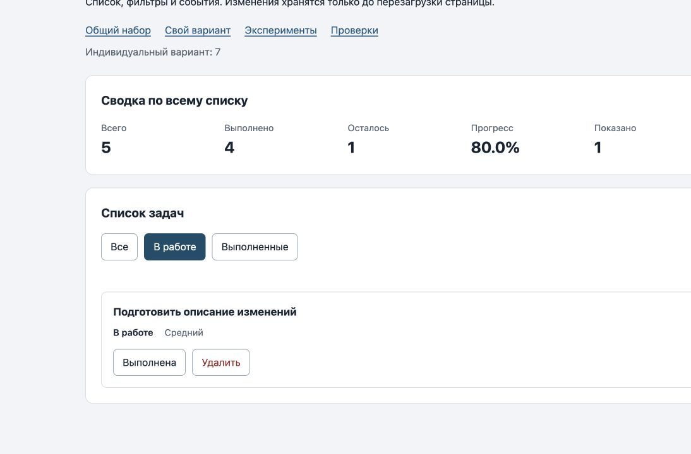

# Практическая работа № 3
Работа с DOM и событиями.

## Автор и окружение
Демидовс Лев, ЭФБО-05-25. Вариант 7 — подготовка учебного релиза.

Проверено 06.10.2026: macOS 27.0, Node.js v24.21.0, npm 11.19.0. Браузер — встроенный браузер Codex, Chrome/154.0.0.0 по user-agent.

## Запуск
Из корня репозитория:
~~~sh
cd practice-03
npm run check:service
npm start
~~~
Установка зависимостей не требуется. Сервер останавливается через Ctrl+C.

- [Общий набор](http://127.0.0.1:5503/)
- [Вариант 7](http://127.0.0.1:5503/index.html?dataset=variant)
- [Эксперименты](http://127.0.0.1:5503/examples/dom-events.html)
- [Браузерные проверки](http://127.0.0.1:5503/checks.html)

Страницы открываются через сервер, так как используются ES-модули. При занятом порте: npm start -- 5505, затем открыть тот же адрес с портом 5505.

## Файлы и состояние
Из ПР2 без изменений перенесены data.js и task-service.js. Все 35 проверок сервиса прошли повторно. ПР3 запускается самостоятельно, без импортов из соседних папок.

- [task-selectors.js](src/task-selectors.js) — выборка по фильтру.
- [task-view.js](src/task-view.js) — карточки, сводка и пустые состояния.
- [main.js](src/main.js) — полный массив currentTasks, фильтр currentFilter и обработчики событий.

На список назначен один обработчик. Он находит кнопку через closest(), переводит id из строки в число и вызывает сервис. renderApp() обновляет интерфейс и не добавляет новые обработчики. Название выводится через textContent.

## Эксперименты
Проверены на странице examples/dom-events.html.

| № | Прогноз | Фактически | Объяснение |
| --- | --- | --- | --- |
| 1 | Отсутствующий элемент — null; пустая коллекция — длина 0 | null и 0 | querySelector возвращает один элемент или null, querySelectorAll — коллекцию. |
| 2 | dataset.taskId — "23", string; после Number — 23, number | Совпало | Атрибуты data-* читаются как строки. |
| 3 | После двух добавлений сохранённый NodeList имеет длину 1, новая выборка — 3 | Старый: 1 и 1; новый: 2 и 3 | Результат querySelectorAll статический. |
| 4 | Разметка в заголовке останется текстом | Строка со strong видна буквально; дочерних элементов 0 | textContent не разбирает HTML. |
| 5 | Захват контейнера, обработчик кнопки, всплытие контейнера | Фазы 1, 3, 3; target всегда lab-label | Нажатие произошло по span внутри кнопки, поэтому на кнопке событие уже всплывает. |

Фактический журнал нажатия на вложенный span:
~~~text
1. phase=1; target=lab-label; currentTarget=lab-card
2. phase=3; target=lab-label; currentTarget=lab-button
3. phase=3; target=lab-label; currentTarget=lab-card
~~~

## Общий сценарий
Все строки ниже проверены в браузере и совпали с таблицей из задания.

| Шаг | Действие | Видимые id | Всего / выполнено / осталось | Прогресс | Показано |
| --- | --- | --- | --- | --- | --- |
| 0 | Начало | [1, 4, 7, 10] | 4 / 2 / 2 | 50.0% | 4 |
| 1 | Фильтр «В работе» | [4, 7] | 4 / 2 / 2 | 50.0% | 2 |
| 2 | Выполнить 4 | [7] | 4 / 3 / 1 | 75.0% | 1 |
| 3 | Фильтр «Все» | [1, 4, 7, 10] | 4 / 3 / 1 | 75.0% | 4 |
| 4 | Удалить 7 | [1, 4, 10] | 3 / 3 / 0 | 100.0% | 3 |
| 5 | Фильтр «В работе» | [] | 3 / 3 / 0 | 100.0% | 0 |
| 6 | «Все», переключить 1 | [1, 4, 10] | 3 / 2 / 1 | 66.7% | 3 |
| 7 | Удалить 1, 4, 10 | [] | 0 / 0 / 0 | 0.0% | 0 |

На шаге 5 получено «Нет задач по выбранному фильтру.», на шаге 7 — «Список задач пуст.». После перезагрузки восстановились четыре исходные задачи, прогресс 50.0%.

## Вариант 7
Перенесены те же шесть задач и приоритеты из ПР2. Названия связаны с подготовкой учебного релиза, изначально выполнены все шесть задач.

| Этап | Ожидание: всего / выполнено / осталось / прогресс | Фактически |
| --- | --- | --- |
| Исходный набор | 6 / 6 / 0 / 100.0% | Совпало; id [11, 23, 37, 41, 58, 64] |
| Переключить 23 | 6 / 5 / 1 / 83.3% | Совпало; задача 23 в работе |
| Удалить 37 | 5 / 4 / 1 / 80.0% | Совпало; id [11, 23, 41, 58, 64] |
| Итог, «В работе» | Только id 23; сводка не меняется | [23]; 5 / 4 / 1 / 80.0% |
| Итог, «Выполненные» | Id [11, 41, 58, 64]; сводка не меняется | Совпало; 5 / 4 / 1 / 80.0% |

## Проверки
~~~text
Проверок пройдено: 35; не пройдено: 0.
Всего: 36. Пройдено: 36. Ошибок: 0.
~~~

[Протокол сервиса](results/service-checks.txt) · [Полный текст браузерных проверок](results/browser-checks.txt).

Проверочные файлы преподавателя сохранены без изменений. Проверялись реальные элементы приложения внутри iframe.

## Собственные проверки
| Действия | Ожидание | Фактически | Итог |
| --- | --- | --- | --- |
| В исходном варианте 7 выбрать «В работе» | Пустая выборка при шести существующих задачах | Видимых 0; всего 6; прогресс 100.0%; сообщение об отсутствии совпадений | Пройдено |
| Пять раз сменить фильтр и шесть раз переключить 23 | Каждое нажатие срабатывает один раз; исходные статусы восстановятся | Всего 6, выполнено 6, прогресс 100.0% | Пройдено |
| В общем наборе Enter на статусе 4, Space там же, Tab к удалению и Enter | Два переключения, удаление 4, фокус на активном фильтре | 75.0% → 50.0% → 66.7%; id [1, 7, 10]; фокус «Все» | Пройдено |

После изменения статуса фокус сохранялся на новой кнопке той же задачи. После удаления переходил на активный фильтр. Проверки преподавателя подтвердили отказы для id 777 и 4abc: состояние не изменяется.

## Отладка
Работу событий проверили через журнал и браузерные сценарии. Демонстрация остановки в DevTools пока не выполнена: управление окном инструментов разработчика оказалось недоступно.

Для завершения этого пункта:
1. В Sources открыть src/main.js, поставить точку на строку 46: чтение card.dataset.taskId.
2. В общем наборе нажать вложенную подпись кнопки статуса задачи 4.
3. После одного шага проверить rawId = "4" (string), затем id = 4 (number), action = "toggle" и найденную задачу.
4. Остановиться на строке 64: у result должен быть ok = true и новый массив. Продолжить выполнение и проверить обновлённую карточку.
5. На странице экспериментов остановиться внутри обработчика кнопки в examples/dom-events.js: target — span#lab-label, currentTarget — button#lab-button.
6. Убрать точки после проверки и записать фактические наблюдения.

Это ожидаемые значения для ручной отладки, а не протокол уже выполненной остановки.

## Вид приложения
Реальный снимок варианта 7 после переключения 23 и удаления 37. Выбран фильтр «В работе», поэтому видна одна задача, а общая сводка учитывает все пять.

## Вывод
Данные хранятся в массиве, фильтр меняет только видимость. Обработчик получает действие и id из DOM, сервис возвращает новый массив, а отображение строится заново. Перезагрузка восстанавливает исходные данные: сохранение в ПР3 не требуется.

[Задание преподавателя](https://github.com/adyshkins/TIP-JS/blob/main/practices/practice-03/README.md).
